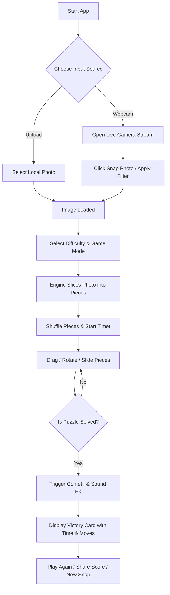

# 🧩 SnapPuzzle — Interactive Camera Photo Puzzle Game

> **Capture your moment. Shatter it into pieces. Solve the puzzle.**  
> *A state-of-the-art Web App that turns live webcam captures and photos into interactive, high-fidelity jigsaw and sliding tile puzzles.*

---

## 🌟 Overview & Concept

**SnapPuzzle** is an immersive, web-based photo puzzle game. With a single click of your webcam or device camera, SnapPuzzle takes your live photo, processes it instantly, and transforms it into an interactive puzzle game with physics, sound effects, visual celebrations, and adaptive difficulty modes.

Whether you're snapping a selfie, taking a photo of a pet, or picking a memorable scene, SnapPuzzle provides instant entertainment with sleek modern aesthetics, dark mode glassmorphism UI, fluid drag-and-drop gameplay, and competitive scoring.

---

## ✨ Key Features & Highlights

### 📸 1. Live Camera & Photo Capture
- **WebRTC Camera Integration:** Real-time video preview with countdown timer, mirror flip option, grid overlays, and instant photo capture.
- **Custom Filters & Enhancements:** Apply instant filters (Cyberpunk, Retro Vintage, Vivid Pop, Grayscale, Neon Glow) before shattering the image.
- **Local File Upload & Drag-and-Drop:** Ability to upload any image file (`.png`, `.jpg`, `.webp`) as an alternative to live capture.

### 🧩 2. Dual Puzzle Engine
- **Classic Jigsaw Mode:**
  - Real interlocking piece shapes generated dynamically on HTML5 Canvas using bezier curves (tabs & sockets).
  - Drag-and-drop mechanics with magnetic snapping when pieces are correctly aligned.
  - Optional piece rotation for an extra challenge (right-click / double-tap to rotate).
- **Sliding Tile Mode (15-Puzzle):**
  - Classic sliding block puzzle with smooth sliding animations.
  - Solvability validation (guaranteeing every shuffled configuration is mathematically solvable).

### 🎚️ 3. Customizable Difficulty Levels
- 🟢 **Easy:** 3 × 3 (9 pieces) — Perfect for quick fun.
- 🟡 **Medium:** 4 × 4 (16 pieces) — Balanced challenge.
- 🟠 **Hard:** 6 × 6 (36 pieces) — For seasoned puzzle solvers.
- 🔴 **Master:** 8 × 8 (64 pieces) — Ultimate test of spatial memory!
- ⚙️ **Custom Grid:** Define your own row × column matrix.

### 🎮 4. Immersive Gameplay & FX
- **Ghost Picture / Reference Toggle:** Preview a translucent guide of the full image or dock a thumbnail in the corner.
- **Auto-Assemble Assistant & Hints:** Highlight piece target slots or auto-place a stubborn piece when stuck.
- **Web Audio API Sound Engine:** Responsive sound effects for piece pickup, snaps, incorrect moves, timer ticks, and victory fanfare.
- **Confetti & Particle Victory Celebration:** High-energy visual particle system when the puzzle is solved.
- **Timer & Move Tracker:** Precision timer, move counter, and performance star rating (1 to 3 stars based on speed & accuracy).

### 🎨 5. Modern UI & Aesthetics
- **Cyber-Glassmorphism Design:** Dark theme elevated with soft blur gradients, ambient backdrops, neon accent glows, and smooth CSS transitions.
- **Responsive & Mobile-Friendly:** Full pointer events support (touch screen swipe/drag for smartphones & tablets).

---

## 🛠️ Architecture & Technology Stack

| Layer | Technology | Purpose |
| :--- | :--- | :--- |
| **Frontend Framework** | HTML5, CSS3, JavaScript (ES6+) | Core user interface & client logic |
| **Media API** | WebRTC `navigator.mediaDevices.getUserMedia` | Live webcam streaming & photo snapshot capture |
| **Puzzle Rendering Engine** | HTML5 2D Canvas API | Dynamic bezier path slicing, piece clipping & tab rendering |
| **Interactivity & Touch** | Pointer Events API / Drag & Drop | Cross-platform desktop & touch gesture controls |
| **Audio System** | Web Audio API / HTML5 Audio | Sound synthesis for snaps, moves, and victory audio |
| **Styling & Effects** | Vanilla CSS (Variables, Flexbox/Grid, Backdrop Blur) | High-performance, lightweight glassmorphism UI |

---

## 🔄 User Workflow



---

## 🚀 Project Development Roadmap

- [x] **Phase 1: Project Proposal & Design Architecture** *(Current)*
- [ ] **Phase 2: Core Foundation & UI Shell**
  - Setup glassmorphism layout, camera view container, and game controls.
- [ ] **Phase 3: Camera Capture & Image Processing Engine**
  - Implement WebRTC media stream, snapshot capture canvas, and filter options.
- [ ] **Phase 4: Jigsaw & Sliding Puzzle Engine**
  - Build bezier-based interlocking jigsaw piece generator.
  - Implement drag-and-drop, magnetic snap detection, and grid mapping.
  - Implement sliding tile algorithm and solvability check.
- [ ] **Phase 5: Audio Engine, Gamification & Particle FX**
  - Integrate Web Audio sound effects.
  - Add timer, move counter, hint system, and victory confetti.
- [ ] **Phase 6: Optimization & Mobile Responsiveness**
  - Test touch input, performance audit, cross-browser compatibility.

---

## 💻 Local Setup & Quick Start

1. **Clone the Repository:**
   ```bash
   git clone https://github.com/sushantguri/Puzzle_photo.git
   cd Puzzle_photo
   ```

2. **Run Locally:**
   - Open `index.html` directly in any modern browser (Chrome, Firefox, Edge, Safari), or
   - Use a local development server (e.g., Live Server or `npx serve .`).

---

## 📜 License

This project is licensed under the MIT License — feel free to modify, build upon, and share!
