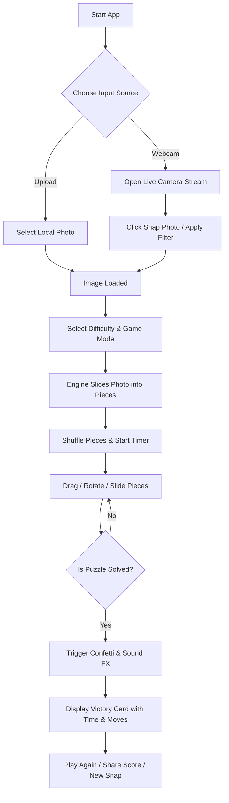

# 🧩 SnapPuzzle — Interactive Camera Photo Puzzle Game

> **Capture your moment. Shatter it into pieces. Solve the puzzle.**  
> *A state-of-the-art Web App that turns live webcam captures and photos into interactive, high-fidelity jigsaw and sliding tile puzzles.*

---

## 🌟 Overview & Concept

**SnapPuzzle** is an immersive, web-based photo puzzle game. With a single click of your webcam or device camera, SnapPuzzle takes your live photo, processes it instantly, and transforms it into an interactive puzzle game with physics, sound effects, visual celebrations, and adaptive difficulty modes.

Whether you're snapping a selfie, taking a photo of a pet, or picking a memorable scene, SnapPuzzle provides instant entertainment with sleek modern aesthetics, dark mode glassmorphism UI, fluid drag-and-drop gameplay, and competitive scoring.

---

## ✨ Key Features & Highlights

### 📸 1. Live Camera & Photo Capture
- **WebRTC Camera Integration:** Real-time video preview with countdown timer, mirror flip option, grid overlays, and instant photo capture.
- **Custom Filters & Photo Editor:** Apply instant filters (Cyberpunk, Retro Vintage, Vivid Pop, Grayscale, Neon Glow) plus Brightness, Contrast, Saturation tuning, 90° rotation, and horizontal/vertical flip controls.
- **Local File Upload & Drag-and-Drop:** Ability to upload any image file (`.png`, `.jpg`, `.webp`) as an alternative to live capture.

### 🧩 2. Dual Puzzle Engine
- **Classic Jigsaw Mode:**
  - Dynamic piece drag-and-drop snapping and tile swap interactions.
- **Sliding Tile Mode (15-Puzzle):**
  - Classic sliding block puzzle with arrow key navigation and smooth animations.
  - Guaranteed solvability validation.

### 🎚️ 3. Customizable Difficulty Levels
- 🟢 **Easy:** 3 × 3 (9 pieces) — Perfect for quick fun.
- 🟡 **Medium:** 4 × 4 (16 pieces) — Balanced challenge.
- 🟠 **Hard:** 5 × 5 (25 pieces) — For seasoned puzzle solvers.
- 🔴 **Master:** 6 × 6 (36 pieces) — Master test!
- ⚡ **Expert:** 8 × 8 (64 pieces) — Ultimate spatial memory test!

- **▶️ Animated Move Playback & Replay:** Step-by-step interactive move replay system (`P` key) with 1x/2x/4x speed controls, timeline scrubber, move highlights, and Web Audio step sound FX.
- **🎖️ Achievements & Badges System:** 9 unlockable trophies with animated toast notifications, sound fanfares, progress bar tracking, and dedicated modal card.
- **🤖 Auto-Solve Demo Assistant:** Interactive animated AI bot (`A` key) that steps through move history or auto-arranges tiles to help players get unstuck.
- **⚡ Time Attack Countdown Mode:** High-stakes race against the clock with an animated progress bar and low-time audio warnings.
- **↩️ Move History & Undo System:** Step-by-step move stack allowing players to undo tile moves (`U` key or `Ctrl+Z`).
- **🔢 Tile Numbers Overlay:** Toggleable position badges (`N` key) to assist on higher difficulty grid layouts (5x5, 6x6, 8x8).
- **⌨️ Keyboard Hotkey Controls:** Arrow keys to slide tiles, `G` for guide, `H` for hints, `N` for numbers, `U` for undo, `A` for auto-solve, `P` for replay, `R` to reshuffle, `Space` to snap photo.
- **📥 Victory Score Badge Generator:** Generate and download high-resolution PNG score cards of completed puzzles with stats overlaid.
- **🔊 Web Audio Preset Engine:** Switchable sound wave synthesis (8-Bit Arcade, Synthwave, Glass Chime).
- **🏆 Local Leaderboard & Hall of Fame:** LocalStorage best times and minimum move tracker.
- **📱 PWA Offline Support:** Built with Web App Manifest (`manifest.json`) and Service Worker (`sw.js`) for 100% offline gameplay.

---

## 🛠️ Architecture & Technology Stack

| Layer | Technology | Purpose |
| :--- | :--- | :--- |
| **Frontend Framework** | HTML5, CSS3, JavaScript (ES6+) | Core user interface & client logic |
| **Media API** | WebRTC `navigator.mediaDevices.getUserMedia` | Live webcam streaming & photo snapshot capture |
| **Puzzle Rendering Engine** | HTML5 2D Canvas API | Dynamic bezier path slicing, piece clipping & tab rendering |
| **Interactivity & Touch** | Pointer Events API / Drag & Drop | Cross-platform desktop & touch gesture controls |
| **Audio System** | Web Audio API / HTML5 Audio | Sound synthesis for snaps, moves, and victory audio |
| **Styling & Effects** | Vanilla CSS (Variables, Flexbox/Grid, Backdrop Blur) | High-performance, lightweight glassmorphism UI |

---

## 🔄 User Workflow



---

## 🚀 Project Development Roadmap

- [x] **Phase 1: Project Proposal & Design Architecture**
- [x] **Phase 2: Core Foundation & UI Shell**
  - Setup glassmorphism layout, camera view container, theme switcher, and game controls.
- [x] **Phase 3: Camera Capture & Image Processing Engine**
  - Implement WebRTC media stream, camera flip mirror toggle, snapshot capture, and image filter sliders.
- [x] **Phase 4: Dual Puzzle Engine & Interaction**
  - Interactive tile swap and drag-and-drop mechanics.
  - Implement sliding tile algorithm with solvability checks.
- [x] **Phase 5: Audio Engine, Local Leaderboard & Particle FX**
  - Synthesize Web Audio sound effects.
  - High Score & Hall of Fame LocalStorage tracking system.
  - Add timer, move counter, hint overlay, and celebration confetti.
- [x] **Phase 6: Optimization & Mobile Responsiveness**
  - Touch input support, responsive grid scaling, cross-browser compatibility.

---

## 💻 Local Setup & Quick Start

1. **Clone the Repository:**
   ```bash
   git clone https://github.com/sushantguri/Puzzle_photo.git
   cd Puzzle_photo
   ```

2. **Run Locally:**
   - Open `index.html` directly in any modern browser (Chrome, Firefox, Edge, Safari), or
   - Use a local development server (e.g., Live Server or `npx serve .`).

---

## 📜 License

This project is licensed under the MIT License — feel free to modify, build upon, and share!
